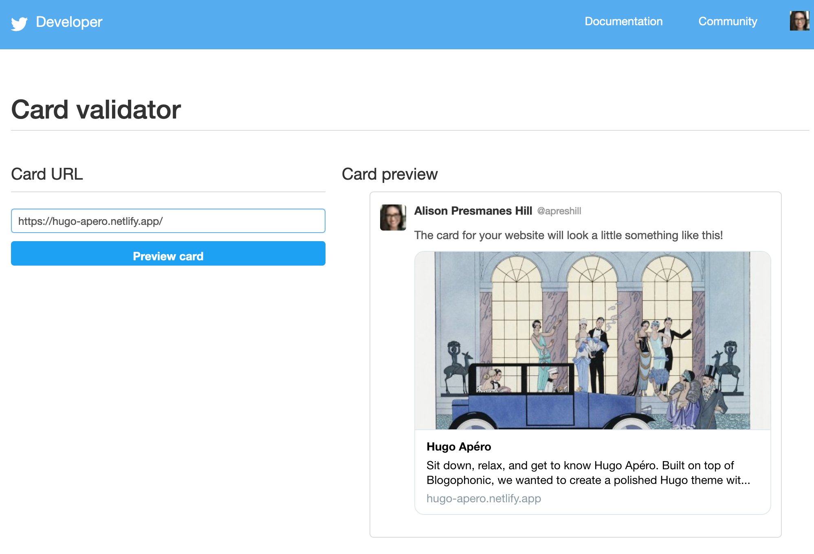

Start customizing your Hugo Apéro homepage by opening up `content/_index.md`. When you open this file, you'll see a long-ish section of YAML with a series of key-value pairs fenced in by three dashes (`---`). There is no content on this page below the YAML.

The underscore in the filename is important, and so is the filename, so don't change this! But do focus on changing the YAML values. 

## Add an image

Place the homepage image in the `static/` folder in the root of your website project (don't add it to your `themes/hugo-apero/static` folder!). Then, in your `_index.md`, set the `images` key to the name of this file. For example:

```yaml
---
images:
  - hello.jpg
---
```

You can place the image file in a subdirectory of `static/` as well. For example, if you place your image in `static/img/` you would put this in your YAML:

```yaml
---
images:
  - img/hello.jpg
---
```

No need to include `static/` in the filepath.

The image you choose will also be the Twitter sharing summary card for the base URL of your site. You can check the sharing card using the [Twitter card validator](https://cards-dev.twitter.com/validator). Here is the sharing card for the theme's [example site](https://hugo-apero.netlify.app/):



## Image on the left or right

Next, decide whether you want your image on the left (`image_left: true`) or the right (`image_left: false`):

```yaml
---
images:
  - img/hello.jpg
image_left: false
---
```

## Customize text

If you place your image on the left, your text will be on the right, and vice versa. The YAML keys for the main text on the homepage are:

```yaml
---
title: "Hugo Apéro"
subtitle: "A Hugo theme you'll want to hang out with"
description: "Welcome to the documentation site for the Hugo Apéro theme!"
---
```

Wherever you place your image and text, you can separately align your text to the left or right:

```yaml
---
title: "Hugo Apéro"
subtitle: "A Hugo theme you'll want to hang out with"
description: "Welcome to the documentation site for the Hugo Apéro theme!"
text_align_left: true
---
```

## Show social icons

To show your social icons on the homepage, set the `show_social_links` key to `true` in your YAML:

```yaml
---
show_social_links: true # specify social accounts in site config
---
```

See [Set up your social](/blog/social/) to find out how to configure your social icons and links.

## Show action link

At the bottom of your `description`, you have the option to add an action link. Set `show_action_link` to `true`, then use the `action_*` keys to configure the link. You can use relative links to other pages in your site by using a relative URL starting with a forward slash, so `/about` for example.

```yaml
---
show_action_link: true
action_link: /about
action_label: "Read More &rarr;"
action_type: text # text, button
---
```

Configure the label for the link with the `action_label` key. You can also include Font Awesome icons using HTML, but be careful of your quotes there:

```yaml
---
action_label: "Read More <i class='fas fa-rocket'></i>"
---
```

Finally, choose between a text display or a clickable button.

That's it! You are done with your homepage.