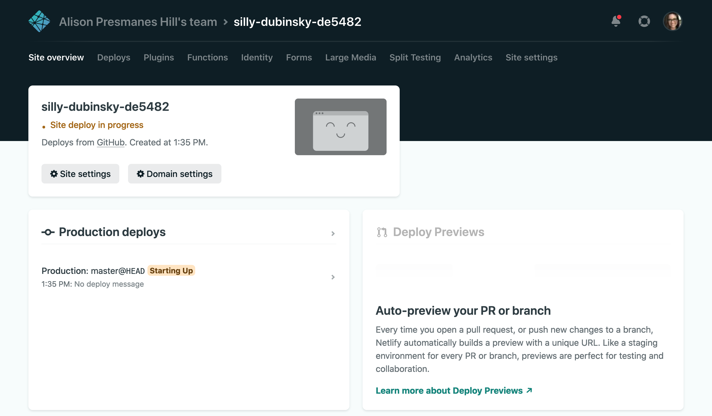
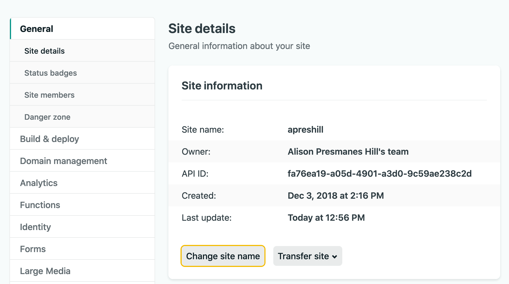

To preview your site locally, we have been using a blogdown function (or Add-in in RStudio):

```r
blogdown::serve_site()
```

If you then push to GitHub, you are committing the source files (but not the built site) to GitHub. This is actually preferred, because we can teach Netlify how to build our site for us using the source files. 

## Push to GitHub

You can use the RStudio to push your current website project to GitHub. How?

+ Click the "Git" tab in upper right pane

+ Check "Staged" boxes for any files with changes you want to commit.

    + To see more detail on what’s changed in file since the last commit, click on "Diff" for a Git pop-up

+ If you’re not already in the Git pop-up, click "Commit"

+ Type a message in "Commit message", such as "commit my website".

+ Click "Commit"

## Connect Netlify to GitHub repo

You already have setup a free Netlify account linked to your GitHub account, [right](../setup/#sign-up-for-netlify)?




1. Log in, and select: 
    `New site from Git > Continuous Deployment: GitHub`.

1. From there, Netlify will allow you to select from your existing GitHub repositories. You'll pick the repo you've been working from with `blogdown`. Leave all settings as they are and select **Deploy Site**.











When it is done, you can click on the link to your new site! And the most magical thing of all, every time you push any changes to your site to GitHub, Netlify will detect the push, re-build, then update your published site. It's a good thing. It's called continuous deployment, and it is the main reason to use Netlify for a blogdown site.

Now, whenever you edit your site content, commit your changes and push to GitHub! Watch as your site rebuilds :tada:

## Update your baseURL

In your [site configuration file](../03-site-config) (`config.toml`), change the `baseURL` there to match where Netlify is publishing your site:

```toml
baseURL = "https://hugo-apero-docs.netlify.app/"
```

Commit and push this change to GitHub.

## Rename your site

With a new site, Netlify will deploy your site and assign you a random subdomain name of the form `random-word-12345.netlify.app`. Mine was particularly unfortunate, with the random word `garbage-collector-janice`. You should know that you can change this; I changed mine to `apreshill.netlify.app`. 




+ Navigate to your site on Netlify

+ Click on **Settings**

+ Under **Site information**, click on the *Change site name* button.











## Netlify configuration

You actually have most of the necessary wiring laid out for you already in your repo, which is why this worked. Our site has a `netlify.toml` file, which sets us the necessary settings for letting Netlify build our site for us and then publish it. You can check this file out using:

```r
# if exists, opens; if not, creates new
blogdown::config_netlify()
```

Now, back in your local blogdown project, let's check this file with blogdown:

```r
> blogdown::check_netlify()
― Checking netlify.toml...
○ Found HUGO_VERSION = 0.80.0 in [build] context of netlify.toml.
| Checking that Netlify & local Hugo versions match...
○ It's a match! Blogdown and Netlify are using the same Hugo version (0.80.0).
| Checking that Netlify & local Hugo publish directories match...
○ Good to go - blogdown and Netlify are using the same publish directory: public
― Check complete: netlify.toml
```


## Custom rbind.io subdomain

To get an `*.rbind.io` URL, head over to: https://github.com/rbind/support/issues/new

The issue template should lead you through the information they need to get your new url set up.

Anytime you change your subdomain name, you'll need to update the `baseURL` in your `config.toml` file.